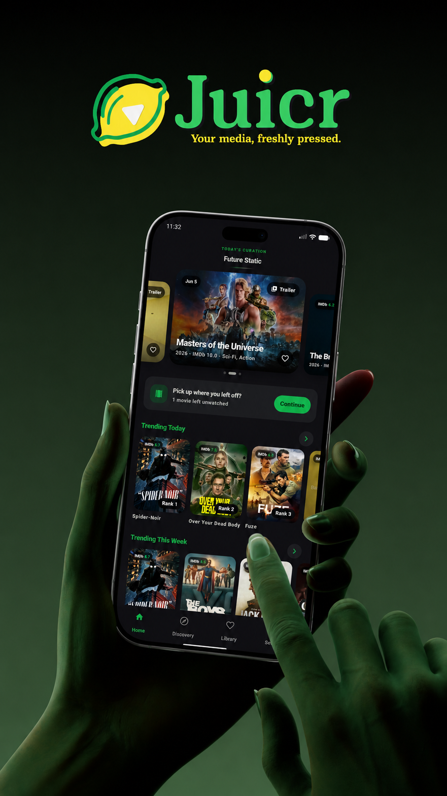
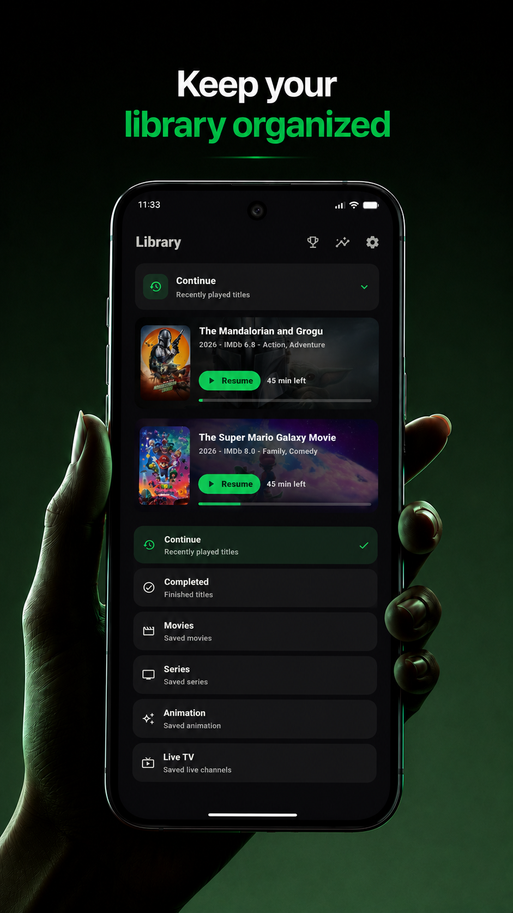
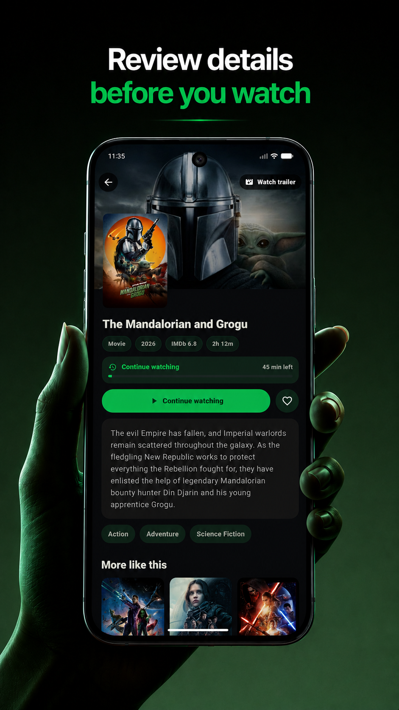
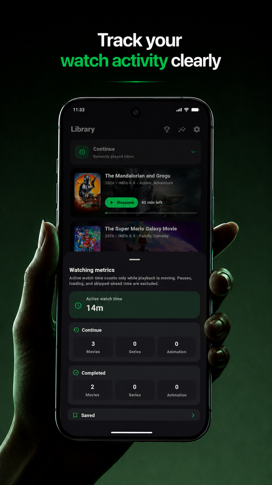
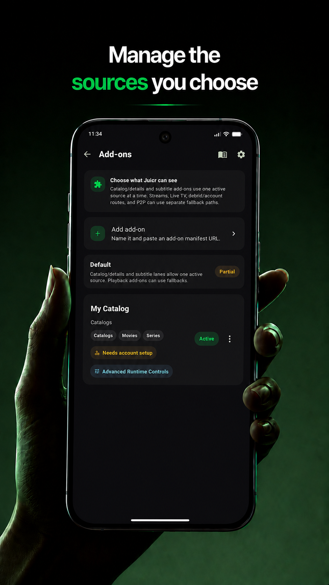
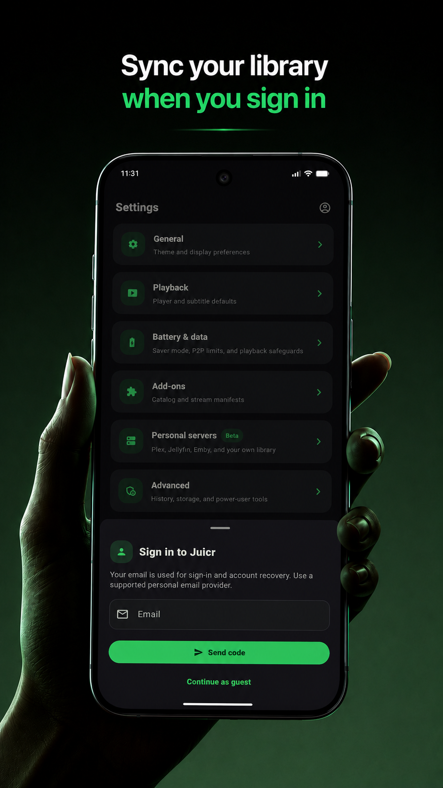
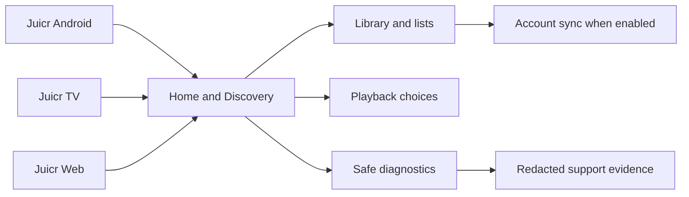

  

  
  
  
  
  
  
  

  <a href="https://github.com/Team-Juicr/Juicr/releases/latest">Latest release</a>
  &middot;
  <a href="https://juicr.app">Website</a>
  &middot;
  <a href="https://ko-fi.com/xc3fff0e">Support</a>
  &middot;
  <a href="RELEASES.md">Release checklist</a>
  &middot;
  <a href="CHANGELOG.md">Changelog</a>
  &middot;
  <a href="CONTRIBUTING.md">Contributing</a>
  &middot;
  <a href="SECURITY.md">Security</a>

---

<h2 align="center">Features</h2>

<table>
  <tr>
    <td width="25%" valign="top" align="center">
      <h3>Source-gated start</h3>
      
Fresh installs start empty, and users decide which browsing, playback, subtitle, trailer, add-on, personal server, or TV options to enable.

    </td>
    <td width="25%" valign="top" align="center">
      <h3>Home and discovery</h3>
      
Browse curated shelves, search across available catalog areas, and move into details without losing your place.

    </td>
    <td width="25%" valign="top" align="center">
      <h3>Library tools</h3>
      
Save titles, organize lists, continue watching, and keep completed history close to the experiences that need it.

    </td>
    <td width="25%" valign="top" align="center">
      <h3>Redacted support</h3>
      
Diagnostics are shaped around safe counts, labels, and timing evidence instead of private playback or account details.

    </td>
  </tr>
</table>

---

<h2 align="center">Screenshots</h2>

<table>
  <tr>
    <td width="25%" align="center" valign="top">
      
      
<strong>Juicr</strong> Browse, save, organize, and play.

    </td>
    <td width="25%" align="center" valign="top">
      
      
<strong>Home</strong> Curated shelves and quick paths.

    </td>
    <td width="25%" align="center" valign="top">
      
      
<strong>Discovery</strong> Search, browse, and filter.

    </td>
    <td width="25%" align="center" valign="top">
      
      
<strong>Library</strong> Lists, history, and saved titles.

    </td>
  </tr>
  <tr>
    <td width="25%" align="center" valign="top">
      
      
<strong>Details</strong> Artwork and playback choices.

    </td>
    <td width="25%" align="center" valign="top">
      
      
<strong>Metrics</strong> Safe support signals.

    </td>
    <td width="25%" align="center" valign="top">
      
      
<strong>Add-ons</strong> Optional capabilities users choose to enable.

    </td>
    <td width="25%" align="center" valign="top">
      
      
<strong>Login</strong> Account access for sync features.

    </td>
  </tr>
</table>

---

<h2 align="center">How To Use</h2>

<ol>
  <li><strong>Install Juicr.</strong> Start with the Android release APK that matches your device, or use the universal APK when you are not sure.</li>
  <li><strong>Choose your setup.</strong> Juicr does not provide media on a fresh install. Enable only the options you want to use.</li>
  <li><strong>Browse Home and Discovery.</strong> Use curated shelves, search, filters, and details pages to find what you want to save or play.</li>
  <li><strong>Build your Library.</strong> Save titles, create lists, revisit continue watching, and keep completed items organized.</li>
  <li><strong>Open Settings when needed.</strong> Tune playback, account, appearance, and privacy-conscious support options from one place.</li>
  <li><strong>Share safe diagnostics.</strong> When support needs evidence, export reports that avoid private source, account, and playback details.</li>
</ol>

<h2 align="center">Advanced And Power Users</h2>

  If you like shaping your own setup, Juicr has you covered. Power users can connect personal servers, add trusted add-ons, tune guarded playback paths, and keep separate source lanes organized without turning a fresh install into a one-size-fits-all app.

<table>
  <tr>
    <td width="25%" valign="top" align="center">
      <h3>Personal servers</h3>
      
Connect your own library and keep it in its own lane. Juicr provides the browsing and playback experience while you manage the server and access.

    </td>
    <td width="25%" valign="top" align="center">
      <h3>Add-ons</h3>
      
Use optional manifests for extra catalog, playback, subtitle, trailer, or Live TV capabilities. You choose what to add, enable, and trust.

    </td>
    <td width="25%" valign="top" align="center">
      <h3>Advanced P2P</h3>
      
Use guarded P2P playback only when it is available, enabled, and approved. Safety checks keep this lane separate from ordinary browsing.

    </td>
    <td width="25%" valign="top" align="center">
      <h3>TV and Web</h3>
      
Some advanced tools are shaped for specific lanes. TV keeps controls remote-first, while Web stays focused on companion browsing and safe surfaces.

    </td>
  </tr>
</table>

  Diagnostics for these features stay redacted. Juicr uses safe labels, counts, and status signals instead of exposing private server, account, connector, or playback details.

<h2 align="center">What Each App Is For</h2>

<table>
  <tr>
    <td width="33%" valign="top" align="center">
      <h3>Juicr Android</h3>
      
The main mobile app for Home, Discovery, Library, playback, account sync, and redacted diagnostics.

    </td>
    <td width="33%" valign="top" align="center">
      <h3>Juicr TV</h3>
      
A lean-back app shaped for remote control, focus navigation, large screens, and TV-first browsing.

    </td>
    <td width="33%" valign="top" align="center">
      <h3>Juicr Web</h3>
      
A browser companion with Juicr-style Home, Discovery, Library, and Settings surfaces.

    </td>
  </tr>
</table>

<h2 align="center">Release Downloads</h2>

<table>
  <tr>
    <td width="25%" valign="top" align="center">
      <h3>Universal</h3>
      
Use this APK when you want one package that covers all supported Android device architectures.

    </td>
    <td width="25%" valign="top" align="center">
      <h3>arm64-v8a</h3>
      
Recommended for most newer Android phones, tablets, and TV devices.

    </td>
    <td width="25%" valign="top" align="center">
      <h3>armeabi-v7a</h3>
      
Use this for older 32-bit Android devices that still need a smaller compatible build.

    </td>
    <td width="25%" valign="top" align="center">
      <h3>x86_64</h3>
      
Useful for compatible emulator and desktop-style Android environments.

    </td>
  </tr>
</table>

<h2 align="center">How It Fits Together</h2>

  Juicr keeps browsing, playback choices, library state, and support evidence separated so users stay in control of what they enable and what they share.

<h2 align="center">Quick Start</h2>

1. Clone the repository.
2. Open `Juicr Android/`, `Juicr TV/`, or `Juicr Web/` depending on the app lane.
3. Run the narrow setup command for that lane.
4. Use bounded scripts and doctors for verification whenever they exist.

<h2 align="center">Build</h2>

Use these commands from the matching app folder when building locally:

- `flutter pub get` to install Flutter dependencies.
- `flutter analyze` for a focused static check.
- `flutter build apk --release` for an Android universal release APK.
- `flutter build apk --release --split-per-abi` for Android ABI APKs.

For release publishing, use the GitHub Actions Android Release workflow. It rebuilds `v1.0.1` and future tags from the repository, restores signing from repository secrets, and uploads the expected APK assets.

<h2 align="center">Project Structure</h2>

<ul>
  <li><code>Juicr Android/</code> - Android mobile app source</li>
  <li><code>Juicr TV/</code> - TV app source</li>
  <li><code>Juicr Web/</code> - Web/PWA companion source</li>
  <li><code>assets/</code> - README and public-safe brand assets</li>
  <li><code>.github/</code> - CI, release, Dependabot, and contribution automation</li>
  <li><code>Scripts/</code> - bounded repository setup and release workflow doctors</li>
  <li><code>CHANGELOG.md</code> - release note source</li>
  <li><code>RELEASES.md</code> - tag and publish checklist</li>
</ul>

<h2 align="center">For Contributors</h2>

<table>
  <tr>
    <td width="50%" valign="top">
      <h3 align="center">Before you send a PR</h3>
      <ul>
        <li>Run the narrowest relevant doctor or focused check for the lane you changed.</li>
        <li>Update release notes when the change affects the shipped app or release automation.</li>
        <li>Keep README, screenshots, and docs aligned with visible UI changes.</li>
      </ul>
    </td>
    <td width="50%" valign="top">
      <h3 align="center">Keep an eye on</h3>
      <ul>
        <li>User-facing copy should stay neutral and product-safe.</li>
        <li>Diagnostics should stay redacted and avoid private playback or account details.</li>
        <li>Release artifacts should be generated by CI or local build scripts, not committed.</li>
      </ul>
    </td>
  </tr>
</table>

<h2 align="center">Privacy And Safety</h2>

Juicr diagnostics are designed to be redacted. Support packets should use safe summaries, screenshots, and timing evidence only.

Diagnostics, logs, app UI, exported reports, and repository examples should avoid private account, source, device, and playback details.

<h2 align="center">License</h2>

Copyright (c) Team Juicr. All rights reserved.

This repository is available for public viewing only. No permission is granted to copy, modify, redistribute, sublicense, sell, host, or create derivative works from Juicr without written permission from Team Juicr.
